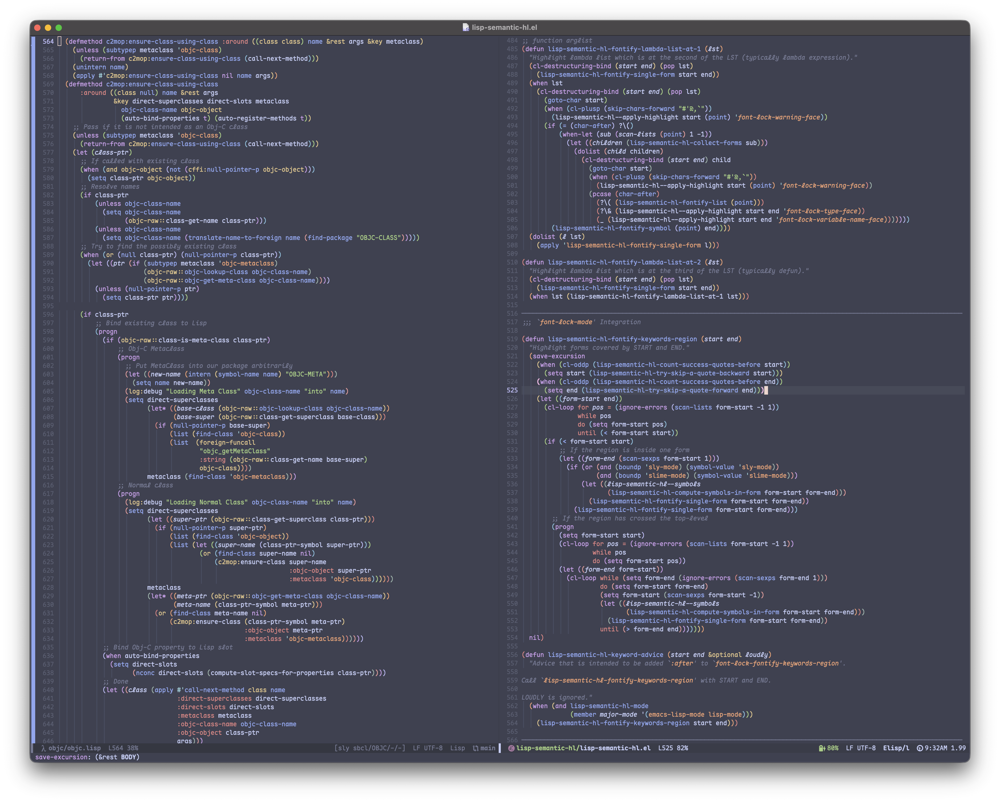

Semantic Syntax Highlighting for Lisp Languages in Emacs
========================================================

[](https://melpa.org/#/lisp-semantic-hl)

Semantic Syntax Highlighting for Common Lisp & Elisp in Emacs, based on the informations of the [global Lisp environment](https://www.lispworks.com/documentation/HyperSpec/Body/03_aaa.htm)



Usage
-----

Load `lisp-semantic-hl.el`, then enable `lisp-semantic-hl` minor mode under `emacs-lisp-mode` or `lisp-mode`.

Sample configuration with :

``` emacs-lisp
(use-package lisp-semantic-hl
  :ensure t
  :hook ((emacs-lisp-mode lisp-mode) . lisp-semantic-hl-mode))
```

Goals
-----

- [ ] Semantic syntax highlight based on the information of the lexical environment for Common Lisp using environment inquiry APIs from CLtL2 and code injection
- [ ] Better support for macros

----------------
Acknowledgements
----------------

Ported from the [LispWorks plugin by ourselves](https://github.com/calsys456/lw-plugins), originally named "colourful". 

Similar function for [Lem](https://github.com/lem-project/lem) can be found [here](https://gist.github.com/calsys456/9acae9310934cd7f2b1066b583dcebe1#file-colourful-lisp) as a reference.

Thanks our sister Simone, and our lover misaka18931, who love and support us.

Supporting Neurodivisity & Transgender & Plurality!

🏳️‍🌈🏳️‍⚧️
